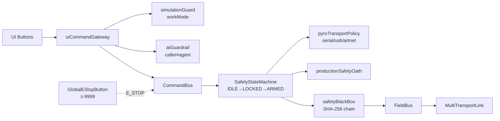
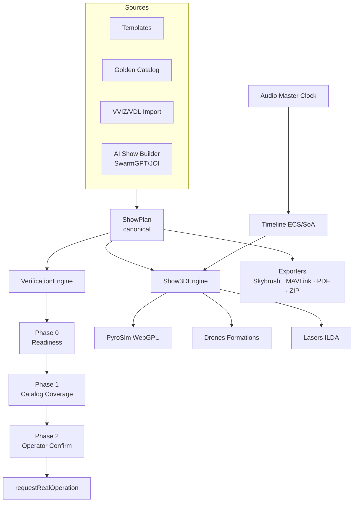
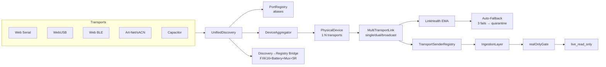

# FXKONTROL — Arquitetura v6 (Quatro Planos Ortogonais)

> Fonte única de verdade arquitetural. Substitui a leitura de ~80 memórias
> para onboarding. Esta é a **ordenação canônica** do que já existe — não
> um rewrite.

## Princípio

Quatro planos ortogonais, cada um com fronteiras de confiança explícitas e
**uma única porta de entrada** auditada.

| Plano | Responsabilidade | Porta única |
|---|---|---|
| **Safety** | E-STOP, ARM/FIRE, modo de trabalho, audit chain | `uiCommandGateway` + `requestRealOperation` |
| **Show** | ShowPlan canônico, IA, simulação, render, exports | `useProjectStore` + `Show3DEngine` |
| **Hardware** | Discovery, transports, telemetria honesta | `unifiedDiscovery` + `deviceAggregator` |
| **Experience** | UI, design system, marketing, training | `pages/` + `features/` |

---

## 1. Safety Plane



**Invariantes não-negociáveis:**
- UI **nunca** chama `safetyStateMachine.transition()` / `fieldBus.send()` / `executor.fire()` direto
- IA **nunca** atinge ARM/FIRE/E_STOP/workMode (`caller='agent'` bloqueado)
- E-STOP global sempre visível, exceto em `/command`
- `real_operation` exige Phase 2 grant fresco (≤5 min) + production oath + plan hash
- Black box: ring 500 com cadeia SHA-256 (tamper-evident)
- Quarentena `__FXK_SAFETY_QUARANTINE__` → recusa real_operation

**Modos de trabalho:**

| Modo | Bloqueios físicos | Uso |
|---|---|---|
| `design` | nenhum | criação livre, IA, render |
| `simulation` | advisory only | dry-run, golden shows, training |
| `real_operation` | TODOS | campo, voo real |

---

## 2. Show Plane



**Decisões consolidadas:**
- ShowPlan é **a** fonte. DMXLAYOUT.ini é puramente visual
- Rotação: Position=YZX (HPR), Effect=PTS (Pan/Tilt/Spin)
- VDL: 25 cores Euclidean, LRU 256
- Timeline: ECS/SoA, zero-GC, 4px dead-zone, snap 30/50/90
- Show3D ↔ Timeline ↔ Audio: clock unidirecional via `useAudioMasterClock`
- Exports honestos: claim policy (`validated`/`pilot`/`marketing_hypothesis`) + disclaimers

**Render pipeline (11 layers, Studio):**
WebGPU compute unified kernel → Bitonic sort → Fire (blackbody) → Smoke (Beer-Lambert) → Wind (Curl Noise 3D) → Scatter → Bloom/Halation → ACES Hue-Preserve → Lens Flare → Film Grain → Atmospheric Depth. Fallback WebGL2 (FBO ParticleGPGPU) gated por flag.

---

## 3. Hardware Plane



**Hardware suportado:**
- **FXK16** — BLE (`ffe0/ffe1/ffe2` handshake) + USB; typed Command API com client-ARM gate, auto-disarm on link loss
- **FireOne FXK-PYRO 2.0** — array/pin stagger
- **Showven** — Sonicboom, SPARKULAR, PyroAdaptor, FX Commander Pro (128 cues, dual-band)
- **Tuya** — BLE Mesh + Wi-Fi (low-precision, **NUNCA** pyro <50ms)
- **CubeMesh RE168 + GalaxyLED**
- **Lasers** — Maiman 16/39CH, ILDA 30-60k PPS
- **DMX/Art-Net** — 33 PPS limit, MA3/GMA2 patch

**Hard rules:**
- Pyro real_operation: priority `[serial, usb, artnet]`, BLE banido
- Stub default: `NO_REAL_SENDER` + `disconnected/unknown` (zero dados sintéticos)
- Identity: `portRegistry.aliases[]` colapsa duplicatas cross-transport
- Hot-plug auto-reopen, persistent authorization por VID/PID

---

## 4. Experience Plane

```text
src/
├─ pages/             ◄── routes
├─ features/          ◄── 12 buckets (barrels READ-ONLY hoje, físico depois)
├─ components/editor/ ◄── home física atual (F5.B migra incremental)
├─ core/              ◄── safety, pyrosim, system/eventBus
├─ render_ultra/      ◄── WebGPU pipeline + fallbacks
├─ hardware/          ◄── transports, scheduler
├─ ai/                ◄── JOI, Joi compiler v2, runtime, replay
├─ stores/            ◄── slim macro (hardwareSync, uiWorkspace)
├─ store/             ◄── per-domain (fleet, scene, viewport, undo, …)
├─ lib/featureFlags/  ◄── flags canônicas
└─ styles/            ◄── tokens
```

**Design System (FXKONTROL DS v1):**
- Tokens `--ds-*`, `--status-*`, `--segment-*`, `--state-*`
- Tipografia única `text-ds-{h1 48 / h2 32 / h3 24 / h4 20 / body 16 / label 14 / caption 12}` + `.ds-mono`
- Fontes: Rajdhani + JetBrains Mono apenas (guard test allow-list)
- Grid editor: topbar 64 / tabs 48 / left 280 / right 320 / timeline 180

**Theming (dois temas, fronteira explícita):**

| Tema | Aplicação | Paleta | Justificativa |
|---|---|---|---|
| **Operacional** (default) | Editor, Command, Field, Training, Pairing, /dev | Vantablack `#050810`, Cyan-dessat `190 70% 58%`, status semantics | OLED smear, E-STOP visibility, WCAG AA campo |
| **Commercial** (opt-in) | Landing, Pricing, Comercial, PitchUS, Unsubscribe | `#1A1A1B`, Electric Blue, Safety Orange | Brief marketing premium |

Guard test `commercialThemeScope.guard.spec.ts` impede vazamento.

**Hierarquia de decisão de design:** safety > consolidado > WCAG AA > brief marketing > estética. Brief perde em 1-3.

---

## 5. Fluxos críticos

### Comando real (worst case, 5 gates)

```text
UI button
 └► uiCommandGateway.fire(cueId)
     └► simulationGuard (workMode != real_operation? advisory)
         └► safetyGate.anyEnforced()
             └► CommandBus.dispatch
                 └► SafetyStateMachine (ARMED required, caller != 'agent')
                     └► verdictForPyroFire (planHash, pyroTransportPolicy)
                         └► safetyBlackBox.append (SHA-256 chain)
                             └► FieldBus.send → MultiTransportLink (priority serial/usb/artnet)
                                 └► LinkHealth track + auto-fallback
                                     └► DeviceEventLog
```

### Design/Sim (zero bloqueios)

```text
UI ─► uiCommandGateway ─► simulationGuard.withSimBypass ─► CommandBus
                                                             └► Show3DEngine (Particle Explosion / Light Point)
```

### Phase gates

```text
ShowPlan ─► VerificationEngine ─► Phase 0 (readiness audit, adapters)
                               ─► Phase 1 (catalog coverage, dry-run)
                               ─► Phase 2 (operator confirmed, hold 1.2s)
                               ─► requestRealOperation (oath + freshness + plan hash)
```

---

## 6. Otimizações estruturais (delta vs hoje)

Mudanças aditivas e seguras, sem quebrar invariantes:

1. **Mapa de portas** — `entry-points.md` lista as únicas portas válidas + guard test que falha se algo importar caminhos proibidos
2. **F5.B incremental** — 1 bucket/sprint movendo físico de `components/editor/` para `features/<bucket>/`. Começar por `safety` e `timeline`
3. **`render_ultra` → `core/render`** — alinhar com `core/safety` e `core/pyrosim` (consistência semântica)
4. **`AdapterReadinessService`** — promover `pendingRequiredAdapters` para serviço de 1ª classe com pub/sub via `eventBus` (`HARDWARE.READINESS_CHANGED`)
5. **safetyBlackBox stream** — append-only para IndexedDB + export `.fxk-blackbox.jsonl` assinado (forensics)
6. **Test plane unificado** — padronizar `*.test.ts` co-located + `__tests__/guard/` para guards arquiteturais
7. **Feature flags doc viva** — gerar `feature-flags.md` automaticamente
8. **Strategic Hub isolation guard** — confirmar que `/strategy` NUNCA importa de `core/safety` ou `hardware/`
9. **Unreal bridge doc** — `unreal-bridge.md` formaliza Pixel Streaming = review-only

---

## 7. Invariantes preservadas

- 4 planos e suas portas únicas
- 3 modos de trabalho
- Tema operacional Vantablack canônico
- Tipografia DS scale + allow-list
- Guard tests existentes (commercial scope, typography, barrels)
- ShowPlan canonical truth
- Identity unification + multi-transport
- Honest hardware (zero dados sintéticos)
- Black box SHA-256 chain
- AI guardrail (`caller=agent` banido em ARM/FIRE)

---

## Resumo de uma linha

> Quatro planos ortogonais (Safety / Show / Hardware / Experience), portas
> únicas auditadas por guard tests, documentação consolidada como fonte
> de onboarding, e migração F5.B incremental — **sem reescrever uma linha
> de runtime crítico**.
