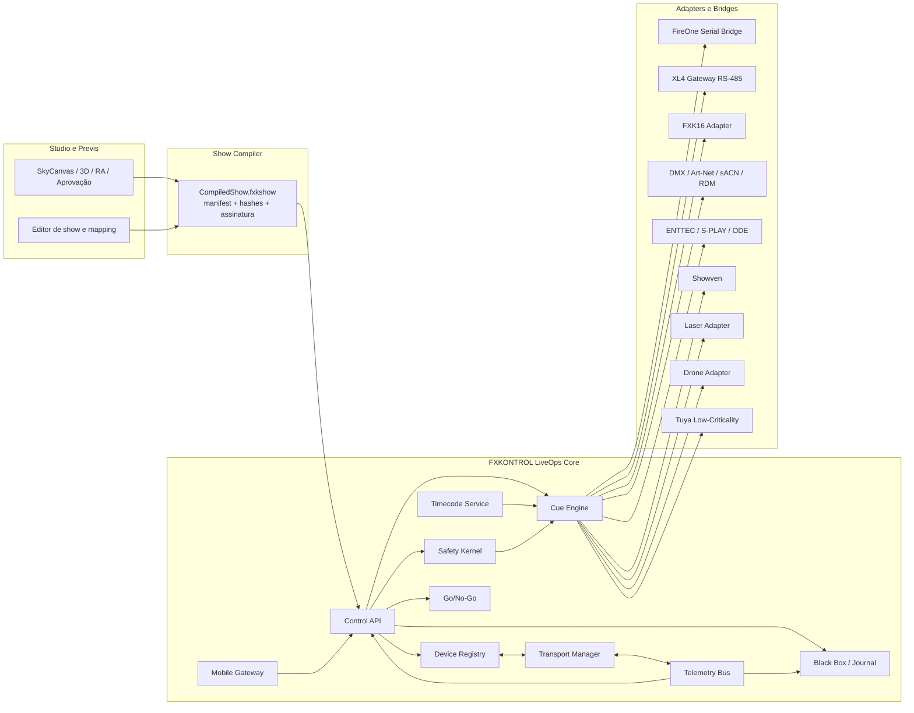
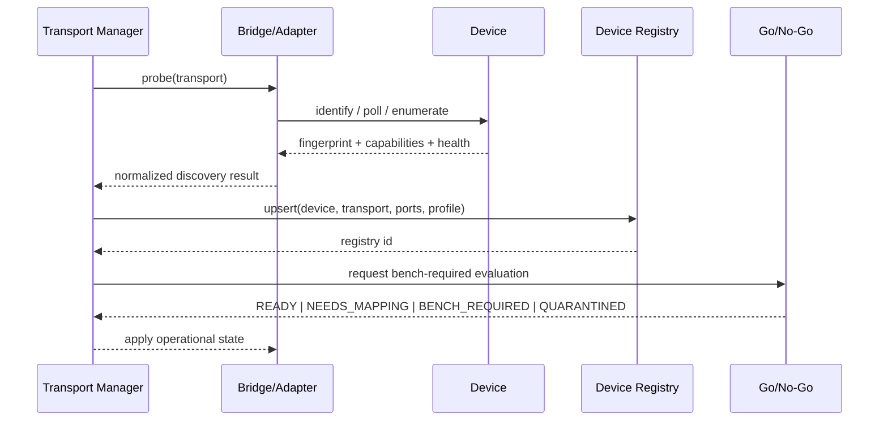
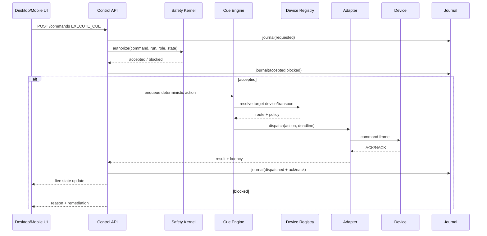
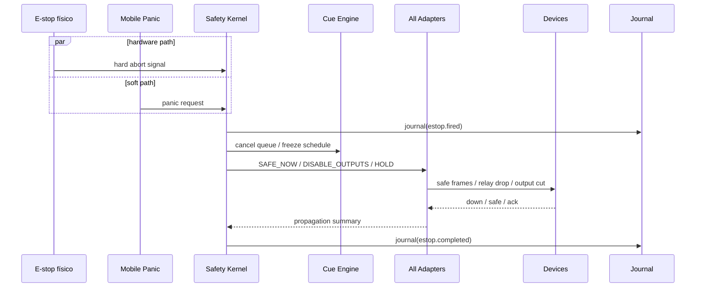
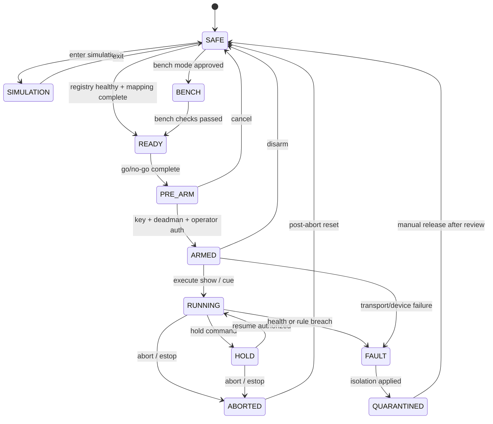

# FXKONTROL como plataforma LiveOps totalmente operacional

## Resumo executivo

O caminho mais seguro e escalável para transformar o FXKONTROL em uma plataforma **LiveOps realmente operacional** é separar, de forma rígida, três camadas que hoje tendem a se misturar em produtos dessa categoria: **Studio/Previs**, **Show Compiler** e **LiveOps Core**. O Studio deve continuar sendo o ambiente de desenho, aprovação comercial, RA/preview e simulação; o Compiler deve transformar esse desenho em um pacote assinado e verificável; e o LiveOps Core deve ser a única superfície autorizada a armar, monitorar, bloquear, disparar, pausar e abortar hardware real. Essa separação é coerente com a estratégia já descrita no próprio material do projeto, que posiciona o FXKONTROL como “The Operating System for Massive Spectacles”, trata o Go-Live Center e o SkyCanvas Previs como pilares, e reconhece que algumas alegações de compliance e parte do alcance multi-transporte ainda estão em estágio piloto ou de hipótese de marketing, não de certificação operacional concluída. fileciteturn0file13

A base arquitetural recomendada para o produto final é: **Safety Kernel** como autoridade central de estado; **Device Registry** como fonte única da verdade sobre hardware; **Transport Manager** como camada de descoberta, health-check, priorização e quarentena; **Cue Engine** para execução determinística; **Timecode Service** para LTC/MTC/GPS/Internal; **Go/No-Go** para readiness; **Black Box/Command Journal** para auditoria imutável; e uma camada de **Adapters/Bridges autorizados** para cada família de hardware. Esse desenho é compatível com o modelo FireOne documentado oficialmente — manual, internal, computer-assisted e mixed mode no XLII+, além de UltraFire com download prévio para módulos e disparo por mensagens de tempo — e também com o ecossistema de iluminação e efeitos que gira em torno de DMX512-A, Art-Net, sACN, RDM, RDMnet e controladores/gateways Ethernet-DMX. fileciteturn0file0 fileciteturn0file6 citeturn12search1turn17view0turn17view3turn15view0turn15view1

No plano de integração, o relatório recomenda explicitamente **não fazer engenharia reversa de firmware nem de protocolos proprietários**. Para FireOne e família XL, a via correta é usar os caminhos documentados e autorizados: comunicação PC-painel por RS-232 DB-9 ou USB serial virtual, workflow de download/verify, operação assistida e, apenas quando houver autorização contratual ou documentação do fornecedor, um bridge serial limitado por políticas. Para dispositivos abertos ou padronizados, a prioridade deve ser inversa: usar standards first. Em Ethernet-DMX, isso significa basear a camada de rede em DMX512-A/E1.11, Art-Net, sACN/E1.31, RDM/E1.20 e RDMnet/E1.33; em SFX, usar integrações que respeitem Pyro Arm, DMX Arm, Deadman, Panic e telemetria em tempo real; em lasers, separar intertravamento óptico do controle visual; em drones, orquestrar por handoff para o stack de voo homologado, não substituir o flight stack; e em Tuya, restringir a automação a usos **não safety-critical**. fileciteturn0file6 fileciteturn0file7 fileciteturn0file2 citeturn17view2turn17view3turn15view0turn15view1turn15view4turn17view6

O critério para declarar o sistema “**100% operacional**” não deve ser “ter muitas telas bonitas” nem “conseguir conversar com parte do hardware”. Deve ser um conjunto verificável de capacidades: descoberta plug-and-play por família; health/heartbeat confiável; travas físicas obrigatórias; journal assinado; modos SIM/BENCH/LIVE claramente segregados; Go/No-Go com evidências; testes de bancada com carga fictícia; validação em 50 ciclos por caminho crítico; integração FireOne por workflow autorizado; integração DMX/Ethernet baseada em standards; mobile local com mTLS; e um conjunto de checklists NFPA/FAA/AHJ suficientemente granular para ser executado antes de cada mobilização. fileciteturn0file13 citeturn2search2turn2search3turn17view4turn14search3turn14search9turn17view8

## Premissas e critérios de projeto

Como o pedido explicitamente autoriza assumir detalhes não especificados como “sem restrição específica”, a especificação abaixo parte das seguintes premissas operacionais e de produto.

| Premissa | Decisão adotada |
|---|---|
| Hardware exato do núcleo FXK não foi congelado | Tratar **FXK16** e **XL4 Gateway RS-485** como hardware próprio do projeto, sob protocolo canônico definido pelo FXKONTROL |
| Integração FireOne deve ser autorizada | **Sem engenharia reversa**; usar workflows documentados, software/bridge homologado, e começar em **read-only/assistido** |
| O stack deve funcionar em campo sem Internet | **Local-first**, com rede operacional isolada e sincronização posterior opcional |
| Não há restrição específica de banco | Adotar **PostgreSQL** para estado operacional e metadados; blobs/evidências em armazenamento local versionado |
| Não há restrição específica de barramento de eventos | Adotar **event bus local** com persistência leve e replay; os exemplos abaixo assumem tópicos e envelopes estáveis |
| O mobile é parte do sistema, não o mestre do sistema | Mobile é **companion**; nunca substitui chave física, deadman, E-stop ou painel primário |
| O 3D é importante comercialmente | Studio/RA/Previs permanece no produto, porém **sem autoridade sobre hardware real** |
| O produto deve conviver com iluminação profissional | O backbone de luz deve respeitar o ecossistema **DMX512-A / Art-Net / sACN / RDM / RDMnet** |
| Drones, lasers e Tuya têm maturidades distintas | Drones entram como **orquestração/handoff**; lasers como **safety profile dedicado**; Tuya apenas como **baixa criticidade** |

Essas premissas são consistentes com a documentação disponível. O FireOne XLII+ opera em modos manual, internal, computer-assisted e mixed mode, usa 2-Wire e wireless, e faz parte de um ecossistema em que o software UltraFire gerencia design, teste e firing com timecode, GPS, áudio, download de arquivos e verificação de módulos. Já o material estratégico do FXKONTROL reconhece que parte do stack está em produção e parte em piloto, o que reforça a necessidade de uma arquitetura em fases, com readiness e segurança acima de “integração total” imediata. fileciteturn0file0 fileciteturn0file6 fileciteturn0file13

Há também um critério importante de **determinismo**. Protocolos e produtos da indústria mostram nitidamente uma diferença entre superfícies de controle “criativas” e superfícies “operacionais”. No lighting, Art-Net e sACN existem para transportar múltiplos universos DMX por rede; RDM e RDMnet existem para descoberta, configuração e monitoramento; e produtos como ENTTEC ODE MK3 e S-PLAY mostram que interfaces web, triggers HTTP/OSC/RS232, DMX bi-direcional e gravação/playback têm lugares distintos na arquitetura. No FXKONTROL, isso implica definir claramente qual link é **controle**, qual é **telemetria**, qual é **trigger**, e qual é **safety**. citeturn17view0turn17view1turn17view2turn15view0turn15view1turn17view3

Por fim, a premissa central de UX é que o produto precisa usar a sofisticação visual do Studio sem contaminar a operação real com metáforas ambíguas. O relatório anexado sobre HUD/AR recomenda viewport livre, cartões contextuais, baixa densidade visual, progressive disclosure, feedback não bloqueante e “glanceability”. Esses princípios são excelentes para Studio/Previs e continuam úteis em LiveOps, desde que a interface operacional preserve a legibilidade de estados críticos, timers, lockouts e intertravamentos. fileciteturn0file3

## Arquitetura-alvo e módulos

A arquitetura recomendada para o FXKONTROL é **local-first, safety-first, adapter-first**. Em vez de “uma aplicação que fala com tudo”, o produto deve ser um conjunto de serviços locais com fronteiras explícitas, capazes de continuar operando mesmo sem cloud, com sincronização posterior de relatórios e artefatos. O diagrama abaixo resume a topologia recomendada; ele combina o posicionamento do próprio FXKONTROL, o workflow FireOne de arquivo/teste/firing e as capacidades de rede de iluminação definidas por Art-Net, sACN e RDMnet. fileciteturn0file13 fileciteturn0file6 citeturn17view0turn17view3turn15view0



A segmentação funcional recomendada é a seguinte.

| Módulo | Responsabilidade principal | Interface primária | Observação de produto |
|---|---|---|---|
| Control API | Receber comandos e consultas | HTTPS + WebSocket local | Nunca dispara hardware diretamente |
| Safety Kernel | Autorizar, bloquear, segurar, abortar | chamadas internas síncronas | Única autoridade sobre estados SAFE/ARM/RUN |
| Device Registry | Fonte única da verdade para hardware | CRUD local + eventos | Nenhuma tela pode “inventar” status |
| Transport Manager | Discovery, heartbeat, health, quarantine | serial/Ethernet/BLE/RS-485 | Mantém a saúde do link, não a lógica do show |
| Cue Engine | Planejar e despachar ações | filas determinísticas | Suporta auto, semi-auto, manual, mixed |
| Timecode Service | LTC, MTC, GPS, Internal, NTP | entradas físicas + software | Um relógio efetivo por run |
| Go/No-Go | Checklist e evidências | UI + anexos + assinaturas | Precede PRE_ARM |
| Black Box / Journal | Auditoria imutável | append-only | Exportável e assinado |
| Mobile Gateway | Sessões mobile limitadas | mTLS + token curto | Controle local, não cloud |
| Adapter Runtime | Device-specific southbound | contrato comum | Normaliza heterogeneidade |

O **Control API** deve ser humano-legível na borda e estritamente tipado internamente. Em termos práticos, isso significa **REST** para comandos e configuração, **WebSocket** para streaming de estado, e um contrato interno de serviço suficientemente rígido para impedir que “atalhos” de frontend virem caminho de disparo. O princípio é simples: a UI pede; o core decide; o adapter executa; o device confirma; a telemetria retorna; o journal registra. Essa separação é coerente com FireOne, cujo próprio software diferencia edição de fire files, system testing, system firing, comunicação com painel e download para módulos, e com controladores modernos como o S-PLAY, que separam interface web, triggers, playback e IOs físicos. fileciteturn0file6 citeturn17view1

O **Cue Engine** deve herdar conceitos consagrados do mundo FireOne e SFX, e não reinventá-los. Ele precisa oferecer pelo menos quatro modos: **manual**, **semi-automático**, **automático** e **mixed**. O XLII+ documenta explicitamente manual, internal, computer assisted e mixed mode; o UltraFire documenta automático, semi-automático e manual; e o FXcommander separa Super DMX, Simple DMX, Manual Fire e Auto Fire. Em outras palavras, o mercado já estabeleceu o vocabulário operacional que o FXKONTROL deve respeitar, mesmo que o UX final seja mais moderno. fileciteturn0file0 fileciteturn0file6 fileciteturn0file7

O **Timecode Service** não deve ser uma simples contagem local. O stack precisa aceitar **Internal**, **LTC**, **MTC/MIDI**, **GPS** e, quando necessário, sincronização de sinks de luz por sACN. O UltraFire já descreve firing por timecode, GPS, CD/arquivo de áudio ou comando do operador; o ecossistema FireOne inclui o TimeMachine para geração e conversão de timecode em múltiplos formatos; e o FXcommander traz entrada LTC e MIDI IN. Em rede de iluminação, a revisão atual do ANSI E1.31 também mantém método de sincronização para múltiplos sinks processarem dados de forma concorrente sob o mesmo controller. fileciteturn0file6 fileciteturn0file7 citeturn13search10turn17view3

Abaixo, um conjunto mínimo de APIs northbound, já em nível de produto.

| Método | Endpoint | Finalidade | Observação |
|---|---|---|---|
| `POST` | `/api/runs/{runId}/commands` | Solicitar ARM, HOLD, ABORT, EXECUTE_CUE, SAFE | Toda ação gera journal |
| `GET` | `/api/devices` | Listar devices e estado atual | Alimenta cards e mapping |
| `POST` | `/api/devices/{id}/actions/discover` | Redescobrir device | Bloqueado em RUNNING |
| `POST` | `/api/golive/{runId}/attestations` | Registrar evidência/checklist | Requer autenticação forte |
| `GET` | `/api/journal/{runId}` | Ler black box | Imutável, filtrável |
| `GET` | `/api/timecode/{runId}` | Estado do relógio | Fonte, drift, lock |
| `WS` | `/ws/telemetry` | Streaming de telemetria e estado | UI reage sem polling |
| `WS` | `/ws/journal` | Streaming de comandos e ACK/NACK | Observabilidade operacional |

## Protocolos, dados e integrações

A decisão correta de protocolos para FXKONTROL é **heterogeneidade na borda, uniformidade no núcleo**. O núcleo deve falar um contrato único de device/command/telemetry; a borda lida com as diferenças entre RS-232, USB serial, RS-485, DMX512-A, Art-Net, sACN, RDM, RDMnet, OSC, HTTP, MIDI, LTC e links proprietários. Essa abordagem combina as capacidades publicadas por FireOne, Artistic Licence, ESTA, ENTTEC, Star, MA Lighting, Showven e Tuya, evitando que cada UI volte a conhecer detalhes de framing, timing, polling ou ack de um fabricante específico. fileciteturn0file6 fileciteturn0file7 fileciteturn0file1 citeturn17view0turn17view2turn17view3turn15view0turn15view1turn15view4turn17view6

Para a parte de iluminação e efeitos em rede, a recomendação é adotar três níveis. **DMX512-A/E1.11** continua sendo o fio-base em cobre e deve ser tratado como o plano físico de saída para fixtures e máquinas. **Art-Net** entra como protocolo de compatibilidade máxima e de implantação simples; a própria Artistic Licence lembra que ele nasceu para superar o limite de um universo DMX e transportar múltiplos universos por Ethernet, e que a evolução para unicast reduziu dramaticamente a carga de rede. **sACN/E1.31**, por sua vez, deve ser o backbone preferencial quando o objetivo for sincronização previsível entre múltiplos sinks e redes maiores, sobretudo porque a revisão ANSI E1.31-2026 explicita mecanismo de sincronização e suporte tanto a IPv4 quanto IPv6. citeturn12search1turn17view0turn17view3

Para **descoberta, configuração e monitoramento**, o stack deve usar **RDM/E1.20** quando a topologia for local na linha DMX, e **RDMnet/E1.33** quando a topologia for IP e o hardware suportar. A descrição de revisão da E1.20 continua clara: RDM permite descoberta dos devices no barramento DMX/E1.11, ajuste remoto de start address e retorno de status/falhas ao controller. Já a E1.33/RDMnet leva essa lógica para redes IP, ampliando monitoramento em larga escala, suporte a dispositivos móveis, configuração de gateways e particionamento entre múltiplos locais na mesma Ethernet. Isso é especialmente útil para um FXKONTROL que pretende unificar pyro, luz, SFX e monitoramento sob um único surface operacional. citeturn15view1turn15view0

A tabela a seguir consolida as famílias de integração mais relevantes a partir dos manuais oficiais anexados e das especificações públicas consultadas. Ela mistura capacidades de produto existentes com contratos propostos para os adapters internos do FXKONTROL. fileciteturn0file0 fileciteturn0file6 fileciteturn0file1 fileciteturn0file7 fileciteturn0file2 fileciteturn0file4 fileciteturn0file5 citeturn17view2turn17view3turn15view0turn15view1turn15view4turn17view6

| Adapter | Discovery | Controle | Telemetria | Classe de segurança | Modo recomendado |
|---|---|---|---|---|---|
| `FireOnePanelAdapter` | serial/USB, fingerprint de painel, firmware, capacidades | read-only → assistido → controlado | painel, módulos, continuidade, fire power, verify state | `pyro_critical` | começar em read-only |
| `FireOneXLFamilyBridge` | igual acima, cobrindo XLII+/XL4+/XLW quando homologado | workflow de arquivo, timecode, hold/abort | status do show, clock, disable, prioridades | `pyro_critical` | por família, não por “raw serial” |
| `XL4GatewayRs485Adapter` | discovery próprio em RS-485 | comandos canônicos FXK | heartbeat, temperatura, tensão, fault codes | `pyro_critical` | hardware interno |
| `FXK16Adapter` | discovery via bridge FXK | continuidade, arm, fire, safe, report | por canal, rail, power, fault | `pyro_critical` | hardware interno |
| `ArtNetSacnAdapter` | ArtPoll, sACN listeners, universes | output/merge/blackout/record | fps, source priority, packet loss | `show_control` | produção |
| `RdmRdmnetAdapter` | discovery de responder/gateway | config, addressing, sensor/status | fault, sensor, UID, topology | `show_control` | produção onde suportado |
| `EnttecAdapter` | web/API, DMX ports, protocol role | ODE/S-PLAY actions, cues, triggers | port buffer, RDM, relay/GPI, playback state | `show_control` | produção |
| `StarArtNet8Adapter` | IP + portas DMX configuráveis | patch e universos | direction, RDM, input activity | `show_control` | produção assistida |
| `ShowvenAdapter` | library/device map, wireless link | scene, cue group, Super DMX, manual/auto | Check Slave, Noise Info, enable/disable | `sfx_critical` | produção piloto |
| `LaserAdapter` | DMX/ILDA/FB4 fingerprint + interlocks | cue visual, shutter enable, safe blackout | shutter, scan-fail, interlock, class | `optical_hazard` | somente com interlock |
| `DroneAdapter` | flight stack/vendor API | missão, hold, abort, sync, handoff | battery, GPS, geofence, Remote ID | `airspace_critical` | orquestração/handoff |
| `TuyaAdapter` | cloud/LAN pair + instruction set | comandos DPs, cenas não críticas | status, online/offline | `low_precision_noncritical` | monitoramento e comodidades |

O caso **FireOne** merece um tratamento especial. A documentação oficial informa que os painéis FireOne se comunicam com o PC por **RS-232 DB-9 ou USB Type B** com porta serial virtual; o software UltraFire separa claramente edição, testes, firing, download para panel e download para modules; e o modo UltraFire depende de **pré-download dos firing sequences para os módulos** seguido do envio de **mensagens de tempo**, com um **verify code** armazenado e reintroduzido antes do show. A conclusão arquitetural, aqui, é muito prática: o FXKONTROL deve integrar FireOne por um **bridge serial autorizado e altamente restrito**, com forte preferência por estados **read-only** e **assistidos** até haver documentação ou autorização inequívoca para controle mais profundo. Isso viabiliza integração sem forçar reverse engineering. fileciteturn0file6

No caso **ENTTEC**, os caminhos são mais abertos e já maduros para produção. O **ODE MK3** oferece duas portas DMX bidirecionais com suporte a E1.20 RDM, conversão Art-Net/sACN/ESP↔DMX, HTP/LTP merge, refresh rate configurável, web interface e PoE 802.3af. O **S-PLAY** acrescenta um show-controller com RS232 DB9, duas portas DMX bidirecionais, Ethernet com Art-Net, sACN, OSC, UDP, Device API, web interface, duas saídas de relé, quatro entradas digitais, MicroSD e USB para backup. Em termos de FXKONTROL, isso significa que ENTTEC pode entrar cedo no roadmap como família “quase pronta” para plug-and-play real. citeturn17view1turn17view2turn8view5turn8view6

O **Star Art-Net DMX 8 Saídas** também é um candidato forte para adapter de produção. O manual em português declara conexão RJ45 com Art-Net ou sACN, RS-232, MIDI IN/OUT, USB para atualização, oito portas DMX 5 pinos fêmea configuráveis como entrada ou saída, duas entradas DMX fixas e compatibilidade com RDM, além de isolamento óptico de até 1500 V. Essa combinação o torna particularmente útil para um FXKONTROL que quer usar o registry para mapear portas, direção, isolamento, universes e função de cada conexão em tempo real. fileciteturn0file1

Para **Showven**, a referência prática é o FXcommander. O manual documenta tela touch de 10,1", separação física entre **Pyro Arm**, **DMX Arm**, **Deadman** e **Panic**, oito teclas físicas, entradas **MIDI IN**, **LTC IN**, **Audio Out**, **Trigger**, DMX em 3 e 5 pinos, além de RDMX para status em tempo real e interfaces como **Check Slave** e **Noise Info**. A implicação para o FXKONTROL é clara: o adapter de SFX precisa expor um modelo de device/cue group/scenes que respeite enable/disable por device, safety channel, repeat/delay logic e monitoramento de link, e o hardware de maleta deve refletir essa ergonomia física, não apenas em UI. fileciteturn0file7

Para **lasers**, a arquitetura precisa ser mais conservadora que em iluminação. O catálogo Optlaser informa controle por **Auto**, **SD-Card**, **DMX512**, **ILDA** e **FB4 on request** em diversos modelos, com classificação **Laser Class 4**, enquanto as séries recentes enfatizam **physical Scan-Fail Safety switch**, **magnetic-force beam shutter** e, em alguns casos, recursos de interlock/cobertura. Isso obriga o FXKONTROL a tratar laser como `optical_hazard`, com validação de interlock, shutter e scan-fail como pré-condições de GO-LIVE; nenhuma UI de conveniência pode “simplificar” isso. fileciteturn0file2

Para **drones**, o melhor desenho é de **orquestração**, não de substituição do flight controller. Nos EUA, o FAA continua tratando o Part 107 como base para small UAS sob 55 lb, com exigência de operação dentro do campo de visão, regras sobre voo sobre pessoas e autorizações de espaço aéreo aplicáveis; em maio de 2026, a FAA ainda tratava o Part 108/BVLOS como regra proposta, não como regra final consolidada. Portanto, o FXKONTROL deve fazer ingestão de missão, relógio, telemetria e estados de hold/abort, mas deixar airworthiness, detect-and-avoid e comandos de voo finalizados nas mãos do stack homologado do operador de drones. citeturn17view4turn14search3turn14search9

Para **Tuya**, a recomendação é descaracterizar o mito de “integração total” e tratá-lo corretamente: **baixa criticidade**. A documentação oficial da Tuya mostra Open APIs de cloud para instruction set, specifications, status e commands; também documenta controle LAN com `ENABLE_TUYA_LAN`, ACK local, timeout de inatividade de 30 segundos e limite de clientes por conexão. Isso é útil para iluminação arquitetural, comodidades e monitoramento auxiliar, mas não atende ao padrão de determinismo e segurança exigido de um caminho de disparo pirotécnico ou abort crítico. citeturn15view4turn17view5turn17view6

A modelagem de dados também precisa refletir essa heterogeneidade. A tabela abaixo resume um esquema de banco suficiente para MVP robusto e para v1 operacional.

| Tabela | Chaves e campos essenciais | Finalidade |
|---|---|---|
| `shows` | `show_id`, `name`, `status`, `customer_id` | Identidade do show |
| `show_versions` | `show_version_id`, `show_id`, `studio_revision`, `created_by` | Versionamento lógico |
| `compiled_shows` | `compiled_show_id`, `show_version_id`, `manifest_hash`, `signature`, `artifact_path` | Pacote assinado para operação |
| `runs` | `run_id`, `compiled_show_id`, `mode`, `site_id`, `started_at`, `ended_at` | Execução operacional |
| `devices` | `device_id`, `family`, `vendor`, `model`, `serial`, `safety_class` | Cadastro principal |
| `device_profiles` | `profile_id`, `family`, `capabilities_json`, `requirements_json` | Perfil por família |
| `device_transports` | `transport_id`, `device_id`, `transport_type`, `address`, `health_state` | Estado do transporte |
| `device_ports` | `port_id`, `device_id`, `port_label`, `direction`, `universe`, `channel_range` | Portas físicas/lógicas |
| `device_mapping` | `mapping_id`, `run_id`, `device_id`, `zone`, `role`, `cue_scope` | Vinculação ao show |
| `telemetry_last` | `device_id`, `ts`, `status_json` | Último estado conhecido |
| `telemetry_samples` | `sample_id`, `device_id`, `ts`, `metric`, `value`, `quality` | Histórico granular |
| `cue_groups` | `cue_group_id`, `compiled_show_id`, `mode`, `priority`, `time_ref` | Agrupamento lógico |
| `cue_actions` | `cue_action_id`, `cue_group_id`, `target_device_id`, `action_type`, `payload` | Ações unitárias |
| `timecode_sessions` | `session_id`, `run_id`, `source`, `offset_ms`, `lock_state` | Sessão de relógio |
| `go_live_checks` | `check_id`, `run_id`, `category`, `result`, `evidence_ref` | Checklist readiness |
| `attestations` | `attestation_id`, `check_id`, `user_id`, `signed_at`, `signature` | Assinaturas e evidências |
| `journal_events` | `journal_id`, `run_id`, `command_id`, `event_type`, `ts`, `payload`, `hash_prev`, `hash_self` | Black box encadeado |
| `transport_quarantine` | `quarantine_id`, `transport_id`, `reason`, `opened_at`, `released_at` | Quarentena e liberação |
| `operator_sessions` | `session_id`, `user_id`, `role`, `device_fingerprint`, `mfa_state` | Sessões locais |
| `mobile_clients` | `mobile_id`, `session_id`, `cert_thumbprint`, `last_seen` | Binding de mobile |
| `evidence_blobs` | `blob_id`, `kind`, `path`, `sha256`, `captured_at` | PDFs, fotos, relatórios, logs |
| `incidents` | `incident_id`, `run_id`, `severity`, `opened_at`, `closed_at` | Eventos pós-show e desvios |

Para além do banco, o FXKONTROL precisa de um **envelope de eventos** canônico. A tabela abaixo define os tópicos mínimos para o barramento interno.

| Tópico | Quando emite | Campos mínimos | Retenção recomendada |
|---|---|---|---|
| `device.discovered` | Novo device encontrado | `deviceId`, `family`, `transport`, `fingerprint` | 30 dias |
| `device.telemetry` | Atualização de estado | `deviceId`, `ts`, `status`, `metrics`, `quality` | amostral 7–30 dias |
| `device.health.changed` | Mudança de health/quarantine | `deviceId`, `old`, `new`, `reason` | 1 ano |
| `cue.command.requested` | UI/API pediu ação | `commandId`, `actor`, `type`, `target`, `runId` | 5 anos |
| `cue.command.dispatched` | Adapter recebeu ordem | `commandId`, `adapter`, `transport`, `deadline` | 5 anos |
| `cue.command.acked` | Device/bridge confirmou | `commandId`, `ackType`, `latencyMs` | 5 anos |
| `cue.command.blocked` | Safety Kernel recusou | `commandId`, `ruleId`, `reason` | 5 anos |
| `safety.state.changed` | Transição de Safety Kernel | `runId`, `from`, `to`, `reason` | 5 anos |
| `golive.check.updated` | Checklist mudou | `checkId`, `result`, `evidenceRef` | 5 anos |
| `timecode.updated` | Lock, drift ou mudança de fonte | `source`, `locked`, `driftMs` | 90 dias |
| `transport.error` | CRC, timeout, reconnect, split-brain | `transportId`, `code`, `severity` | 1 ano |
| `estop.fired` | Abort / E-stop | `source`, `runId`, `propagationMs` | permanente contratual |

Os exemplos abaixo mostram o formato mínimo recomendado para **telemetria** e **command journal**.

```json
{
  "$schema": "https://json-schema.org/draft/2020-12/schema",
  "$id": "fxk.telemetry.envelope.v1",
  "type": "object",
  "required": [
    "eventId",
    "eventType",
    "ts",
    "deviceId",
    "family",
    "transport",
    "status",
    "metrics",
    "quality"
  ],
  "properties": {
    "eventId": { "type": "string", "format": "uuid" },
    "eventType": { "const": "device.telemetry" },
    "ts": { "type": "string", "format": "date-time" },
    "deviceId": { "type": "string" },
    "family": { "type": "string" },
    "transport": {
      "type": "object",
      "required": ["type", "address", "state"],
      "properties": {
        "type": { "type": "string" },
        "address": { "type": "string" },
        "state": { "type": "string" },
        "rssi": { "type": "number" },
        "latencyMs": { "type": "number" }
      }
    },
    "status": {
      "type": "object",
      "required": ["online", "health", "safetyState"],
      "properties": {
        "online": { "type": "boolean" },
        "health": { "type": "string" },
        "safetyState": { "type": "string" },
        "mode": { "type": "string" }
      }
    },
    "metrics": {
      "type": "object",
      "properties": {
        "batteryPct": { "type": "number" },
        "temperatureC": { "type": "number" },
        "continuityOk": { "type": "integer" },
        "continuityFail": { "type": "integer" },
        "dmxFps": { "type": "number" },
        "packetLossPct": { "type": "number" }
      },
      "additionalProperties": true
    },
    "quality": {
      "type": "object",
      "required": ["source", "staleMs"],
      "properties": {
        "source": { "type": "string" },
        "staleMs": { "type": "integer" },
        "confidence": { "type": "number", "minimum": 0, "maximum": 1 }
      }
    }
  }
}
```

```json
{
  "$schema": "https://json-schema.org/draft/2020-12/schema",
  "$id": "fxk.command.journal.v1",
  "type": "object",
  "required": [
    "journalId",
    "commandId",
    "runId",
    "ts",
    "actor",
    "command",
    "decision",
    "hashPrev",
    "hashSelf"
  ],
  "properties": {
    "journalId": { "type": "string", "format": "uuid" },
    "commandId": { "type": "string", "format": "uuid" },
    "runId": { "type": "string", "format": "uuid" },
    "ts": { "type": "string", "format": "date-time" },
    "actor": {
      "type": "object",
      "required": ["type", "id"],
      "properties": {
        "type": { "type": "string", "enum": ["operator", "mobile", "system", "estop"] },
        "id": { "type": "string" },
        "role": { "type": "string" }
      }
    },
    "command": {
      "type": "object",
      "required": ["type", "target"],
      "properties": {
        "type": { "type": "string" },
        "target": { "type": "string" },
        "payload": { "type": "object" }
      }
    },
    "decision": {
      "type": "object",
      "required": ["result", "safetyState"],
      "properties": {
        "result": { "type": "string", "enum": ["accepted", "blocked", "timed_out", "nacked", "forced_safe"] },
        "ruleId": { "type": "string" },
        "reason": { "type": "string" },
        "safetyState": { "type": "string" }
      }
    },
    "adapterTrace": {
      "type": "array",
      "items": {
        "type": "object",
        "required": ["adapter", "transport", "status"],
        "properties": {
          "adapter": { "type": "string" },
          "transport": { "type": "string" },
          "status": { "type": "string" },
          "latencyMs": { "type": "number" }
        }
      }
    },
    "hashPrev": { "type": "string" },
    "hashSelf": { "type": "string" },
    "signature": { "type": "string" }
  }
}
```

Os fluxos operacionais mais críticos são os de **discovery**, **command path** e **E-stop**. A modelagem abaixo combina: descoberta e configuração padronizada via RDM/RDMnet/Art-Net/sACN em lighting; PC-to-panel communication e verify/download do FireOne; e links ACK-oriented em LAN/serial. fileciteturn0file6 citeturn15view0turn15view1turn17view0turn17view1turn17view2turn17view6







## Experiência operacional e maleta

A experiência do FXKONTROL deve ser desenhada com duas verdades simultâneas. A primeira é que o ambiente de criação precisa ser prazeroso, cinemático e orientado a contexto; a segunda é que a operação real precisa ser brutalmente clara, anti-ambiguidade e anti-surpresa. O relatório de interface anexado ao projeto é muito útil aqui: ele propõe viewport livre, live cards contextuais, “glanceability”, redução de sobrecarga cognitiva, feedback não bloqueante e progressive disclosure. A recomendação é reaproveitar esses princípios no **Studio/Previs**, e transportar apenas o que ajuda a decisão rápida para o **Commander** operacional. fileciteturn0file3

No **desktop**, a tela principal deve ser organizada em cinco zonas fixas: **safety rail**, **cue stack**, **device wall**, **timecode/status strip** e **black box pane**. A safety rail fica sempre visível e inclui chave, deadman, E-stop, fire power/arm state, Go/No-Go e permissões do operador. A cue stack mostra “agora”, “próxima”, lockouts, priorities e tempo restante. A device wall usa cards por device, sempre com `last telemetry age`, `transport`, `health`, `mode`, `evidence pending` e ações. O time strip mostra a fonte do relógio e o drift. O black box pane é append-only e nunca some em modo live. Essa estratégia é consistente com os modos e testes descritos pela FireOne e com a ergonomia física do FXcommander, que separa Pyro Arm, DMX Arm, Deadman, Panic e teclas rápidas. fileciteturn0file0 fileciteturn0file7

No **mobile**, o papel é complementar. O mobile companion deve ter apenas quatro visões: **Overview**, **Checklist**, **Devices** e **Emergency**. Overview mostra o estado agregado. Checklist permite assinar evidências de Go/No-Go. Devices mostra cards com filtros e busca. Emergency expõe apenas **HOLD** e **ABORT**, com confirmação forte e latência observável. Não deve haver engenharia de UX que “embelez e esconda” o fato de que um toque em ABORT é uma ação crítica. Também não deve haver caminho mobile para contornar deadman, chave física ou operador local licenciado. Essa limitação não é conservadorismo gratuito; ela decorre da natureza dos próprios equipamentos, que na prática industrial continuam valorizando autoridade física local e intertravamentos explícitos. fileciteturn0file0 fileciteturn0file7

A **maleta**, por sua vez, deve ser tratada como produto físico de primeira classe, não como “um notebook em case”. O manual FireOne mostra a importância de estabilidade elétrica e de USB/serial — incluindo orientação para “Always On/High Performance”, desabilitar USB selective suspend e impedir que hubs USB sejam desligados pelo sistema operacional. Em campo, isso significa que o projeto da maleta precisa considerar SO, barramento, aterramento, ventilação, ergonomia, blindagem e conectividade como parte da plataforma, e não como detalhe de implantação. fileciteturn0file6

A tabela abaixo descreve um inventário de hardware recomendado para a maleta e para o kit-base de integração.

| Bloco | Especificação recomendada | Função operacional |
|---|---|---|
| Chassi | Case rugged IP54 ou superior, shock-mounted | Campo, transporte, vibração |
| PC industrial | x86-64, 32 GB RAM, SSD NVMe 1 TB, 2x Ethernet Intel, TPM 2.0 | Host do LiveOps local |
| SO | Windows LTSC/IoT Enterprise endurecido para compatibilidade de drivers e vendor apps | Interop com FireOne e bridges |
| UPS DC interno | 20–30 min de autonomia + monitoramento | Ride-through em queda breve |
| Tela principal | 13"–15" touch de brilho alto | Commander local |
| HMI física | Mushroom E-stop, chave ARM/FIRE, deadman mantido, HOLD dedicado, buzzer, luzes de estado | Intertravamento físico |
| Serial isolado | 2–4 portas RS-232/RS-485 isoladas | FireOne, XL4 gateway, legados |
| Ethernet | 2x RJ45 + 1x EtherCON | Lighting/drone/mobile LAN |
| DMX | 2–4 XLR 5 pinos via interface isolada | DMX local e bench |
| LTC/MIDI | LTC IN/OUT, MIDI IN/OUT | Timecode e compatibilidade SFX |
| USB | múltiplas USB-A industriais + USB-B when needed | dongles, backup, vendor tools |
| Wi-Fi local | AP dedicado 5 GHz/6 GHz isolado | mobile companion |
| GNSS | receptor GPS disciplinado opcional | timecode/localização |
| Impressão/etiquetagem | opcional térmica | identificação, relatório local |
| DockTwin | carga fictícia, patch panel, loopback, simuladores de ACK | bancada e serviceability |

Em termos de interação, a maleta deve seguir regras explícitas.

| Regra | Especificação |
|---|---|
| Badge de modo | SIM / BENCH / LIVE sempre visível, impossível de ocultar |
| Ação irreversível | Exige confirmação por dois passos e journal imediato |
| Colorimetria | Vermelho reservado para bloqueio/risco/armed; não usar vermelho como decoração |
| Freshness | Todo card de device mostra `idade da telemetria` |
| Sem modais em RUNNING | Erros e avisos aparecem como painéis laterais/não bloqueantes |
| Estado stale | Telemetria vencida muda cor e retira permissões relacionadas |
| Foco físico | HOLD, ABORT, deadman e chave são manipuláveis sem depender de touchscreen |
| Operação cega | Ações críticas têm feedback sonoro e luminoso, não só visual |

Esse desenho conversa diretamente com o que já existe em controladores profissionais. O FXcommander evidencia a utilidade de chaves e teclas físicas dedicadas; o S-PLAY mostra o valor operacional de relés, GPIs, RS232 e web interface no mesmo appliance; e a família grandMA3 confirma a expectativa do mercado de que portas DMX sejam flexíveis, nós de rede tenham 1 Gbit/s e RDM esteja presente quando necessário. fileciteturn0file7 citeturn17view1turn17view2 fileciteturn0file4 fileciteturn0file5

## Segurança, compliance e readiness

A especificação de segurança do FXKONTROL precisa unir **safety de show**, **security de software** e **compliance regulatório** sem confundir as três coisas. Safety é o que impede disparo indevido, exposição óptica indevida, perda de estado durante execução e retomada insegura; security é o que protege APIs, sessões, artefatos, certificados e supply chain; e compliance é o que prova aderência a padrões e a exigências de cada autoridade. O erro clássico em produtos desse tipo é tratar safety como um subconjunto de security ou como uma feature de UI. Não é. fileciteturn0file13 citeturn17view8turn7view9turn7view10

O **Safety Kernel** precisa ser a autoridade formal dos estados operacionais. Ele não é apenas um “booleano armado”. Ele é uma máquina de estados, com transições autorizadas, trilha de decisão e bloqueios por regra. A modelagem abaixo é a recomendada para v1.



As regras de bloqueio devem ser explícitas, versionadas e auditáveis. Um comando de cue deve ser recusado se houver ausência de Go/No-Go, ausência de operador local autorizado, deadman inativo, perda de heartbeat, continuidade `FAIL`, continuidade `NC` em canal crítico, drift excessivo de timecode, device em quarentena, link degradado sem política de fallback, ou qualquer divergência entre `compiled_show_hash` e `mapped_device_plan_hash`. Essa filosofia é compatível com o que os manuais FireOne tratam como fire power test, continuity test, verify code e computer-assisted operation, e com a separação de arm/deadman/panic documentada no FXcommander. fileciteturn0file0 fileciteturn0file6 fileciteturn0file7

Em **criptografia e autenticação**, a combinação recomendada é a seguinte. Para tráfego IP sensível, usar **TLS 1.3 com mTLS**, dado que o RFC 8446 a define como o padrão atual para proteger aplicações contra escuta, adulteração e falsificação. Para links e payloads com requisito explícito de AEAD em ambientes constrained, usar **AES-128-GCM**, alinhado à NIST SP 800-38D. Para derivação de chaves a partir de senha em pairing ou recuperação offline, usar **PBKDF2** conforme NIST SP 800-132/RFC 8018, nunca como substituto de certificados. Para assinatura de pacotes de show, usar **COSE** sobre **CBOR**, com assinatura **Ed25519/EdDSA**. Essa combinação entrega objetos pequenos, assináveis e verificáveis offline, o que é adequado para maleta, gateways e artefatos de show. citeturn7view9turn7view10turn15view9turn15view7turn15view8turn6search15

A política recomendada para o artefato `CompiledShow.fxkshow` é: `manifest.json/cbor`, lista de devices e maps, hash SHA-256 de cada subartefato, policy bundle, anexos opcionais e assinatura COSE_Sign1. Antes de PRE_ARM, o runtime valida assinatura, identidade do signer, hashes internos, compatibilidade de perfis e coerência entre registry e plan. Em famílias que operem por download prévio para módulos — como no modelo UltraFire —, deve existir também um **arming challenge** ou **verify code** equivalente, de forma que o operador confirme localmente que o que está no campo bate com o show compilado. Isso se inspira diretamente na lógica de verify code do UltraFire. fileciteturn0file6 citeturn15view7turn15view8

O **Command Journal/Black Box** deve ser imutável e encadeado. O material estratégico anexado ao projeto já reivindica granularidade de 100 ms para journal como funcionalidade validada; a recomendação deste relatório é ir além internamente, gravando timestamp monotônico de alta resolução, mas sem oferecer ao produto final menos do que essa granularidade declarada. O formato deve incluir hash encadeado (`hash_prev`, `hash_self`), assinatura do lote, correlação por `commandId` e exportação em PDF/JSON assinado. fileciteturn0file13

A **quarentena** não pode ser apenas um ícone vermelho. Ela precisa ter regra operacional.

| Evento | Regra | Ação automática | Liberação |
|---|---|---|---|
| 3 heartbeats perdidos | transporte crítico | entrar em `DEGRADED`; se `pyro_critical`, forçar `SAFE` | checklist técnico |
| CRC/frame mismatch repetido | serial/RS-485 | bloquear comando novo e abrir incidente | reset + teste de bancada |
| ACK timeout em RUNNING | device crítico | HOLD imediato; se persistir, ABORT | revisão manual |
| Divergência de show hash | qualquer adapter | bloquear PRE_ARM | recompilar/remapear |
| RDM scan conflitante | lighting control | rebaixar para monitor-only | recertificar patch |
| Interlock laser aberto | laser | shutter off + bloqueio de cue | inspeção local |
| Tuya sem ACK ou offline | low criticality | ocultar controle e manter apenas status | reconectar |
| Mobile split-brain | dois devices com mesmo papel crítico | revogar sessão mais antiga e exigir rebind | autenticação local |

No plano de **compliance**, o FXKONTROL deve tratar os padrões como “baseline operacional”, não como selo automático do produto. Nos EUA, **NFPA 1123** continua sendo a referência para displays profissionais de fogos ao ar livre; **NFPA 1126** cobre pirotecnia diante de audiência próxima, inclusive em ambientes de produção, shows e venues; e o próprio material estratégico do FXKONTROL reconhece que alegação de conformidade NFPA/FAA ainda é “design-aligned, not certified” e que cada show exige revisão do AHJ. Para drones, o FAA continua destacando o **Part 107** para small UAS sob 55 lb e, em maio de 2026, o BVLOS/Part 108 ainda aparecia como proposta/NPRM, não como regra final consolidada. citeturn2search2turn2search3turn2search7turn17view4turn14search3turn14search9 fileciteturn0file13

O checklist de readiness/compliance recomendado é o seguinte.

| Área | Evidência mínima antes de LIVE |
|---|---|
| Outdoor fireworks | aderência operacional a NFPA 1123, distâncias, setup, handling, crew, spectators |
| Proximate pyrotechnics | aderência operacional a NFPA 1126, venue, performer protection, docs do operador |
| AHJ | licença/credencial quando exigida, permissão local, plano aprovado, contatos de emergência |
| Drones | piloto certificado quando aplicável, autorizações de espaço aéreo, geofence, NOTAM/procedimentos locais, Remote ID quando exigido |
| Lasers | interlock testado, shutter funcional, scan-fail validado, zonas e ângulos assinados |
| Elétrica e rede | aterramento, UPS, isolamento, PoE/DC corretos, endereçamento e labeling |
| Operação | deadman testado, E-stop testado, fire power/continuity testados, operador autenticado |
| Software | show assinado, hash validado, build provenance, SBOM disponível, rollback ensaiado |

Há um ponto adicional importante para a integração entre Studio e operação: o **ANSI E1.59 Object Transform Protocol** existe para transportar posição, orientação e velocidade em rede IP, mas a própria revisão referenciada pela ESTA diz que esses dados destinam-se a coordenar elementos visuais e sonoros e **não devem ser usados para aplicações safety-critical**. Isso é perfeito para digital twin, posicionamento de assets e overlay espacial; não é adequado como base de decisão de ignição ou de liberação de intertravamento. citeturn15view2

## Validação, roadmap e aceite

A transformação em LiveOps operacional exige um programa de testes em camadas. O FireOne UltraFire separa explicitamente **System Testing** de **System Firing**, com module power, e-match continuity, fire power e ferramentas como communications tester, module mapper e timecode analyzer; o XLII+ manualiza continuity test, fire power test, presets e uso do deadman; e o material estratégico do FXKONTROL já admite que a captura de evidências de Go-Live ainda precisa evoluir de manual para automática. Logo, o plano correto é construir uma pipeline de validação que una **bench**, **dummy load**, **fault injection**, **replay do journal**, **50 ciclos de validação por caminho crítico** e só depois piloto de campo. fileciteturn0file0 fileciteturn0file6 fileciteturn0file13

A matriz de validação recomendada é a seguinte.

| Família de teste | Método | Critério mínimo |
|---|---|---|
| Unitário | regras do Safety Kernel, parser de protocolos, assinatura de show, mapping | cobertura alta em regras críticas |
| Contrato | adapters contra simuladores e fixtures de teste | 100% de compatibilidade do contrato |
| Integração | API + registry + journal + timecode | run completo em SIM/BENCH |
| HIL bench | maleta + bridges + dummy load + loopbacks | 50 ciclos sem estado inseguro |
| Failover | perda de rede, cabo, alimentação, ACK timeout | sistema entra em HOLD/SAFE conforme política |
| Performance | latência de dispatch, journal, WS telemetry | limites por família documentados |
| Segurança | mTLS, rotação de cert, replay protection, privilege checks | nenhuma rota crítica sem auth forte |
| Campo controlado | dispositivos reais sem efeito ao vivo | checklist e evidências completas |
| Piloto real | show de escopo limitado com equipes treinadas | zero escapada de safety policy |

A validação de **50 ciclos** deve ser concreta, não simbólica. Para cada caminho crítico, executar 50 vezes: discovery; map/unmap; PRE_ARM→ARMED→SAFE; continuidade; fire power; dispatch de cue em dummy load; HOLD/RESUME; ABORT/E-stop; rebind de mobile; e restart de bridge. Em links seriais e RS-485, incluir reconnect e ruído controlado. Em Ethernet-DMX, incluir broadcast storm control, troca de source priority e merge conflict. Em timecode, incluir drift, loss-of-lock e mudança controlada de fonte. O alvo não é “não dar erro”; é provar que, quando dá erro, o state machine cai no lado seguro. Essa filosofia também conversa com os alertas de FireOne sobre energia, baterias, suspensão USB e power management. fileciteturn0file6

Para **CI/CD e automação de testes**, a recomendação é ancorar o produto em três referências. A primeira é a **NIST SSDF**, inclusive em sua versão em português, que enfatiza integração de práticas seguras ao SDLC, preparo organizacional, proteção dos componentes contra adulteração e identificação de vulnerabilidades residuais. A segunda é **SLSA**, cujo objetivo explícito é prevenir adulteração, melhorar integridade de artefatos e dar garantias crescentes sobre a cadeia de suprimentos. A terceira é a disciplina de **SBOM**, promovida pela CISA, para transparência dos componentes do software. Para o FXKONTROL, isso se traduz em: build reproduzível; provenance assinado; SBOM por release; testes de contrato obrigatórios; promotion gates entre `dev`, `bench`, `field-pilot` e `production`; assinatura de instaladores e bundles; e rollback testado. citeturn16view3turn17view8turn17view7turn6search1

O backlog abaixo prioriza a entrega por valor operacional.

| Sprint | Entrega principal | Saída exigida |
|---|---|---|
| S1 | Device Registry + modo SIM/BENCH/LIVE | cards reais, freshness, persistência |
| S2 | Safety Kernel v1 + journal append-only | state machine e bloqueios básicos |
| S3 | Control API + WS telemetry | UI desacoplada do hardware |
| S4 | Art-Net/sACN/DMX adapter v1 | discovery, universes, blackout, monitor |
| S5 | RDM/RDMnet adapter v1 | discovery/config/status em lighting |
| S6 | Go/No-Go + evidências + PDFs | checklist operacional utilizável |
| S7 | FireOne bridge read-only | fingerprint, painel, clock, mode, health |
| S8 | Cue Engine v1 | manual, semi-auto, auto, mixed |
| S9 | Mobile companion local | mTLS, roles, HOLD/ABORT, checklist |
| S10 | Maleta v1 + DockTwin bench | hardware operacional e bancada |
| S11 | FireOne assistido + verify/hash flow | workflow de arquivo e arming seguro |
| S12 | Showven/laser adapters | SFX/laser com safety profile |
| S13 | Drone adapter/handoff | telemetria, sync, hold/abort |
| S14 | Quarantine + incident workflow | fault containment e liberação |
| S15 | Piloto de campo controlado | aceitação parcial |
| S16 | Release candidate operacional | pacote v1 pronto para rollout limitado |

Em termos de **fases de implantação**, a sequência recomendada é: **fundação local**, **lighting backbone**, **safety e Go/No-Go**, **FireOne read-only**, **FireOne assistido**, **mobile/maleta**, **SFX/laser/drone**, e só então **operação multi-hardware completa**. Esse roadmap reflete a maturidade já documentada no projeto: algumas áreas já aparecem como produção, como Go-Live e previs; outras ainda são piloto ou hipótese. fileciteturn0file13

A matriz de risco mais relevante é a seguinte.

| Risco | Probabilidade | Impacto | Mitigação |
|---|---|---|---|
| UI confunde simulação com operação | alta | crítica | badge SIM/BENCH/LIVE, registry como SoT |
| Bridge FireOne avançar sem autorização | média | crítica | read-only/assistido primeiro, sem reverse engineering |
| Sleep/USB suspend no campo | média | alta | SO endurecido e checklist de power management |
| Broadcast excessivo em Art-Net | média | alta | unicast preferencial, VLANs, storm control |
| Falta de evidência em Go/No-Go | alta | alta | evidence center obrigatório e exportável |
| Split-brain entre desktop e mobile | média | alta | sessão única por papel crítico, revogação automática |
| Tuya ser usado em caminho crítico | média | crítica | classificar adapter como low-criticality only |
| Laser sem interlock válido | baixa | crítica | release bloqueado por policy |
| Drift de timecode em show híbrido | média | alta | time source único e monitorado |
| Supply chain insegura do software | média | alta | SSDF, SLSA, SBOM, assinatura e provenance |

O critério de aceite para declarar o FXKONTROL “**100% operacional**” deve ser objetivo.

| Critério | Aceite mínimo |
|---|---|
| Separação Studio/LiveOps | Studio não possui rota de hardware crítico |
| Registry | 100% dos devices operacionais entram por discovery ou onboarding controlado |
| Safety | todo comando crítico passa pelo Safety Kernel |
| Journal | 100% dos comandos e transições críticos são registrados |
| Go/No-Go | execução bloqueada sem checklist completo |
| FireOne | integração autorizada funcionando ao menos em read-only/assistido |
| DMX backbone | Art-Net + sACN + DMX + RDM funcionando em bench e campo |
| Mobile | local-only, mTLS, sem bypass físico |
| Maleta | suporta bench e field sem dependência de notebook genérico |
| Quarantine | transportes e devices podem ser isolados e liberados formalmente |
| Bench | 50 ciclos aprovados por caminho crítico |
| Campo | piloto real sem violação de policy e com black box íntegro |

A conclusão operacional é direta: **FXKONTROL não deve tentar “virar Ultr aFire, grandMA, S-PLAY, FXcommander, console laser e flight stack ao mesmo tempo”**. Ele deve virar o **orquestrador LiveOps** que costura esses mundos com uma gramática comum de segurança, telemetria, readiness e execução. FireOne já oferece um modelo maduro de fire file, verify code, continuity/fire power e timecode; Art-Net/sACN/RDM/RDMnet oferecem o backbone aberto de iluminação e monitoramento; produtos como ODE MK3 e S-PLAY já demonstram interfaces modernas entre web, DMX e Ethernet; Showven demonstra a importância da ergonomia física; Optlaser evidencia que laser exige safety profile próprio; e o cenário regulatório de drones exige handoff e disciplina, não improviso. O FXKONTROL fica tecnicamente mais forte quando respeita essas fronteiras e as transforma em um núcleo único de decisão operacional. fileciteturn0file0 fileciteturn0file6 fileciteturn0file7 fileciteturn0file2 citeturn17view0turn17view1turn17view2turn15view0turn17view4